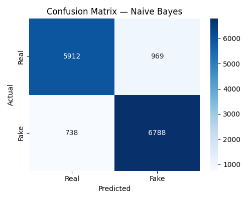
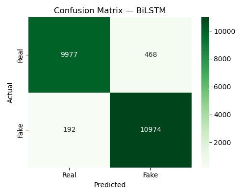
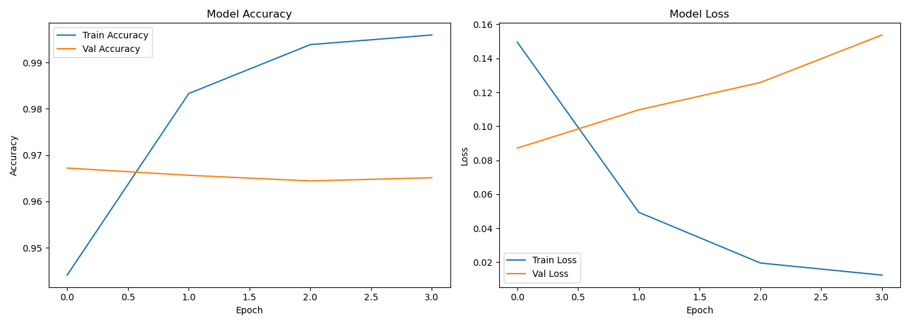
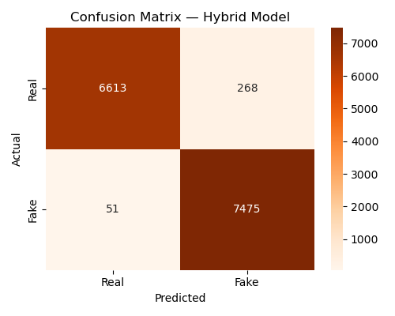
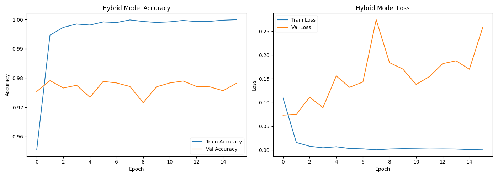
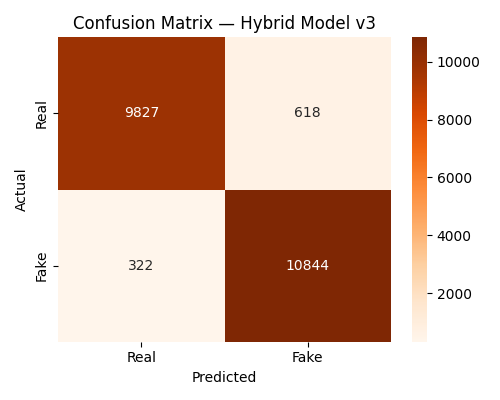
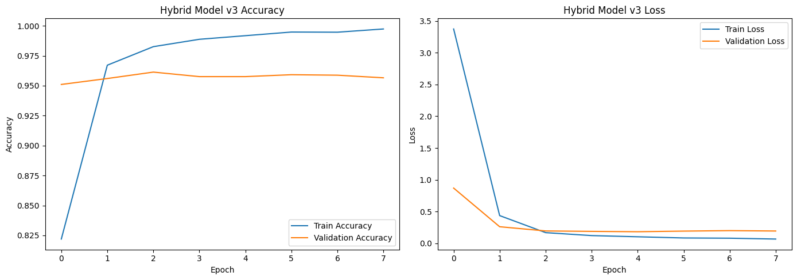

# 📰 Real-Time Fake News Detection using Machine Learning, BiLSTM and Hybrid Deep Learning Models

## 📌 Project Overview

This MSc project focuses on detecting fake news using Natural Language Processing (NLP), Machine Learning, and Deep Learning techniques.

The system evaluates multiple classification approaches including traditional Machine Learning algorithms, a BiLSTM deep learning architecture, and a Hybrid TF-IDF + BiLSTM model to identify whether a news article is Real or Fake.

The project also aims to extend fake news detection towards real-time news verification using external news APIs and interactive user interfaces.

---

## 🎯 Objectives

- Detect fake news articles using AI-based approaches
- Compare Machine Learning and Deep Learning models
- Develop a Hybrid Model combining TF-IDF and BiLSTM
- Analyze model performance using evaluation metrics
- Build a framework for real-time fake news detection
- Provide a user-friendly interface for prediction

---

## 🚀 Features

### Machine Learning Models
- Logistic Regression
- Naive Bayes
- Support Vector Machine (SVM)

### Deep Learning Models
- Bidirectional Long Short-Term Memory (BiLSTM)

### Hybrid Models
- TF-IDF + BiLSTM Hybrid Architecture
- Improved Hybrid Model v3 with regularization and early stopping

### Additional Components
- NLP preprocessing pipeline
- Feature engineering module
- Model comparison framework
- Real-time prediction module (under development)
- Streamlit-based GUI (under development)

---

## 🧠 Technologies Used

### Programming Language
- Python

### Machine Learning
- Scikit-learn

### Deep Learning
- TensorFlow
- Keras

### NLP Libraries
- NLTK

### Data Handling
- Pandas
- NumPy

### Visualization
- Matplotlib
- Seaborn

### Deployment
- Streamlit

---

## 📂 Dataset

### Dataset Used
**WELFake Dataset**

The dataset contains:
- News Titles
- News Content
- Labels (Real / Fake)

> Dataset files are excluded from this repository due to GitHub size limitations.


---

## 📊 Experimental Results

### 🔹 Logistic Regression


---

### 🔹 Naive Bayes



---

### 🔹 Support Vector Machine (SVM)


---

### 🔹 BiLSTM Confusion Matrix



---

### 🔹 BiLSTM Training Curve



---

### 🔹 Hybrid Model (TF-IDF + BiLSTM)

#### Confusion Matrix



#### Training Curve



---

### 🔹 Hybrid Model v3

#### Confusion Matrix



#### Training Curve



---

## 📈 Model Performance Comparison

| Model | Status |
|---------|---------|
| Logistic Regression | Completed |
| Naive Bayes | Completed |
| SVM | Completed |
| BiLSTM | Completed |
| Hybrid (TF-IDF + BiLSTM) | Completed |
| Hybrid Model v3 | under development |

Detailed results are available in:

```text
models/ml_results.csv
models/final_comparison.csv
```

---

## 🔄 Current Progress

✅ Data preprocessing completed

✅ Feature engineering completed

✅ Machine Learning models trained and evaluated

✅ BiLSTM model trained and evaluated

✅ Hybrid model implemented and evaluated

🔄 Hybrid Model v3 implemented and evaluated

✅ Confusion matrices generated

✅ Training curves generated

🔄 Real-time API integration under development

🔄 Streamlit interface under development

---

## 🔮 Future Enhancements

- Real-time news collection using News APIs
- Social media news verification
- GPT/Gemini-assisted fact verification
- BERT and RoBERTa based models
- Model deployment using Streamlit Cloud
- Explainable AI (XAI) integration
- Live fake news monitoring dashboard

---

## ⚙️ Installation

Clone the repository:

```bash
git clone https://github.com/Avijit0104/fake-news-detection-msc.git
```

Move into project directory:

```bash
cd fake-news-detection-msc
```

Install dependencies:

```bash
pip install -r requirements.txt
```

Run the project:

```bash
python main.py
```

---

## 📚 Research Significance

This project investigates the effectiveness of Machine Learning, Deep Learning, and Hybrid Architectures for fake news detection and provides a foundation for future real-time misinformation detection systems.

---

## 👨‍💻 Author

**Avijit Bose**

M.Sc. Project – Fake News Detection using AI & NLP

---

## 📄 License

This project is developed for academic and research purposes.