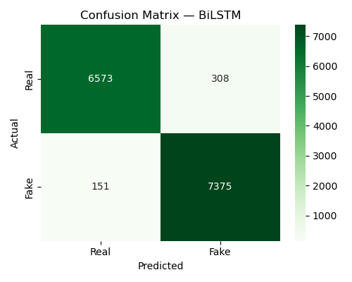

#  Real-Time Fake News Detection Software

##  Project Overview
This project aims to detect fake news using AI and NLP techniques. It combines traditional machine learning, deep learning, and real-time data analysis.

##  Features
- Fake news detection using ML (Logistic Regression, Naive Bayes, SVM)
- Deep learning model (BiLSTM)
- Hybrid model (TF-IDF + BiLSTM)
- Real-time news detection (API-based)
- URL-based news verification
- Streamlit GUI 

##  Technologies Used
- Python
- Scikit-learn
- TensorFlow / Keras
- NLTK
- Pandas
- Streamlit

##  Current Progress
 Data preprocessing completed  
 ML models trained and evaluated  
 BiLSTM model implemented  
 Hybrid model training in progress  
 Initial project structure created  

##  Note
Datasets are not included due to size limitations.

##  Results & Outputs

### 🔹 Machine Learning Models Performance
- Logistic Regression, Naive Bayes, and SVM were trained using TF-IDF features.

### 🔹 Confusion Matrix (SVM)

### 🔹 Confusion Matrix (Naive Bayes)

### 🔹 Deep Learning Model (BiLSTM)

### 🔹 Training Curve (BiLSTM)

### 🔹 Model Comparison
Results stored in:
- `models/ml_results.csv`
- `models/full_comparison.csv`

##  Author
Avijit Bose
